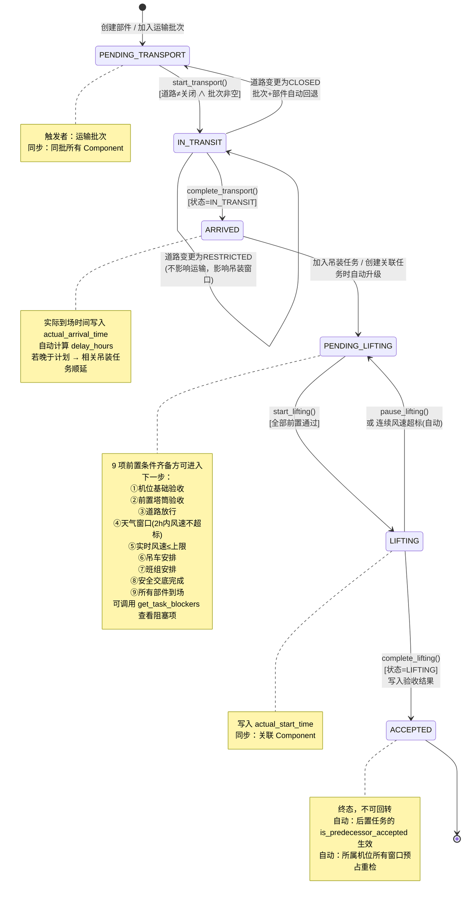

# 吊装运输组织系统 — 现有实现交接文档

> 文档版本：v1.0 | 梳理日期：2026-06-21
> 适用范围：从「机位待运输」到「吊装已验收」的全链路业务实现

---

## 一、项目架构概览

项目采用 **FastAPI + SQLAlchemy ORM + SQLite** 的典型三层分层架构：

| 层次 | 目录 | 职责 |
|------|------|------|
| 路由层 | [app/routers/](file:///Users/ding/Documents/SOLOCODE%203/0619/macmini/zj-00406-towerlift-4/app/routers) | HTTP 接口暴露、参数解析、异常转换 |
| 服务层 | [app/services/](file:///Users/ding/Documents/SOLOCODE%203/0619/macmini/zj-00406-towerlift-4/app/services) | 业务编排、状态流转、级联联动 |
| 规则层 | [business_rules.py](file:///Users/ding/Documents/SOLOCODE%203/0619/macmini/zj-00406-towerlift-4/app/services/business_rules.py) | 状态机校验、前置条件判定、窗口预占检查 |
| 模型层 | [models.py](file:///Users/ding/Documents/SOLOCODE%203/0619/macmini/zj-00406-towerlift-4/app/models/models.py) | 数据表 ORM 映射、枚举定义、关系配置 |
| 视图层 | [schemas.py](file:///Users/ding/Documents/SOLOCODE%203/0619/macmini/zj-00406-towerlift-4/app/schemas/schemas.py) | Pydantic 序列化/反序列化模型 |

路由分组：
- [transport.py](file:///Users/ding/Documents/SOLOCODE%203/0619/macmini/zj-00406-towerlift-4/app/routers/transport.py) → `/api/transport` 大件运输、道路卡点、道路状态
- [lifting.py](file:///Users/ding/Documents/SOLOCODE%203/0619/macmini/zj-00406-towerlift-4/app/routers/lifting.py) → `/api/lifting` 吊装任务、安全交底、天气记录、窗口预占
- [master_data.py](file:///Users/ding/Documents/SOLOCODE%203/0619/macmini/zj-00406-towerlift-4/app/routers/master_data.py) → `/api/master` 机位、部件（塔筒分段等）、吊车、作业班组
- [stats.py](file:///Users/ding/Documents/SOLOCODE%203/0619/macmini/zj-00406-towerlift-4/app/routers/stats.py) → `/api/stats` 全局统计、准点率、天气延误、机位进度

---

## 二、核心模块逐一说明

### 2.1 塔筒分段（Component 模块）

**核心实体**：`Component`（通用部件表，`component_type=tower_section` 时即为塔筒分段）

**枚举**：`ComponentType` = `tower_section`（塔筒分段）| `nacelle`（机舱）| `hub`（轮毂）| `blade`（叶片）

**关键字段**（见 [models.py L67-L92](file:///Users/ding/Documents/SOLOCODE%203/0619/macmini/zj-00406-towerlift-4/app/models/models.py#L67-L92)）：
- `component_code`：唯一编号（如 T-001）
- `component_type` + `tower_section_number`：分段类型 + 段号（1=底段、2=中段、3=上段…）
- `site_id`：归属机位
- `transport_batch_id`：关联运输批次
- `lifting_task_id`：关联吊装任务
- `status`：与运输批次/吊装任务**共用同一套 TaskStatus 状态机**

**服务实现**：[master_data_service.py](file:///Users/ding/Documents/SOLOCODE%203/0619/macmini/zj-00406-towerlift-4/app/services/master_data_service.py) 中 `create_component / get_components / update_component`

**⚠️ 设计要点**：
1. 部件自身**不持有独立状态机**，其 `status` 完全由所属的运输批次和吊装任务**级联覆盖**：
   - 加入运输批次 → 同步为批次的 `PENDING_TRANSPORT`
   - 批次开始/完成运输 → 所有部件同步为 `IN_TRANSIT` / `ARRIVED`
   - 加入吊装任务（且部件已到场）→ 升级为 `PENDING_LIFTING`
   - 吊装开始/验收 → 所有部件同步为 `LIFTING` / `ACCEPTED`
2. 因此**不能直接通过修改 component.status 来驱动业务**，必须通过运输批次或吊装任务的状态接口。

---

### 2.2 大件运输批次（TransportBatch 模块）

**核心实体**：`TransportBatch`（一组部件的一次运输任务）

**关键字段**（见 [models.py L94-L119](file:///Users/ding/Documents/SOLOCODE%203/0619/macmini/zj-00406-towerlift-4/app/models/models.py#L94-L119)）：
- `batch_code`：批次编号（如 TR-2024-001）
- `departure_time / planned_arrival_time / actual_arrival_time`：起运、计划到场、实际到场
- `origin → destination`：起运地 → 目的地
- `road_status`：关联道路放行状态（OPEN/CLOSED/RESTRICTED）
- `status`：共享 `TaskStatus` 状态机（只用前三个状态：PENDING_TRANSPORT / IN_TRANSIT / ARRIVED）
- `delay_hours / delay_reason / weather_delay_hours`：延误统计
- 关联 `components[]`（部件列表）和 `checkpoints[]`（道路卡点列表，按 sequence 排序）

**服务实现**：[transport_service.py](file:///Users/ding/Documents/SOLOCODE%203/0619/macmini/zj-00406-towerlift-4/app/services/transport_service.py)

**驱动状态流转的核心接口**：
| 动作 | 服务函数 | 路由 | 前置条件（can_start_transport / can_complete_transport） |
|------|----------|------|--------------------------------------------------------|
| 创建批次 | `create_transport_batch` | POST /api/transport/batches | 传入 component_ids 时自动关联并同步状态 |
| 开始运输 | `start_transport` | POST /batches/{id}/start | ① 状态=PENDING_TRANSPORT ② 道路≠CLOSED ③ 批次非空 |
| 完成运输 | `complete_transport` | POST /batches/{id}/complete | ① 状态=IN_TRANSIT |
| 更新道路状态 | `update_road_status` | PUT /batches/{id}/road-status | 会触发运输暂停/恢复的自动级联（见下文 2.3） |

---

### 2.3 道路状态（RoadStatus + RoadCheckpoint）

**道路状态枚举**（挂在运输批次上，不是独立表）：
- `OPEN` = 放行 → 可正常运输
- `RESTRICTED` = 受限 → 运输可继续，但窗口预占标记为 PENDING，相关吊装任务计划自动顺延 6h
- `CLOSED` = 关闭 → 无法开始运输；若已在运输中则**自动回退到 PENDING_TRANSPORT**；相关吊装计划顺延 24h

**触发级联逻辑**：[transport_service.py L350-L417](file:///Users/ding/Documents/SOLOCODE%203/0619/macmini/zj-00406-towerlift-4/app/services/transport_service.py#L350-L417) `update_road_status`

级联动作一览：

| 道路变化 | 对运输批次的影响 | 对吊装任务/窗口预占的影响 |
|----------|-----------------|--------------------------|
| OPEN → CLOSED（已在运输中） | 状态回退 IN_TRANSIT → PENDING_TRANSPORT，部件同步回退；写状态历史 | 未开始的任务计划顺延 24h；重跑窗口预占检查 |
| OPEN → RESTRICTED | 运输继续 | 未开始的任务计划顺延 6h；重跑窗口预占检查 |
| CLOSED → OPEN（曾被暂停） | 若 can_start_transport 通过则自动恢复为 IN_TRANSIT，部件同步恢复 | 重跑窗口预占检查 |
| 任何变化 | — | 所属机位所有 PENDING/CONFIRMED/REJECTED 的窗口预占全部重新检查 |

**道路卡点 RoadCheckpoint**：纯信息记录 + 通过标记（`passed` / `pass_time`），**不参与业务校验和状态流转**，仅用于运输过程跟踪。接口：POST/PUT `/checkpoints`。

---

### 2.4 天气记录（WeatherRecord）

**核心实体**：`WeatherRecord`（每条记录绑定一个吊装任务，风速实测点）

**关键字段**（见 [models.py L235-L251](file:///Users/ding/Documents/SOLOCODE%203/0619/macmini/zj-00406-towerlift-4/app/models/models.py#L235-L251)）：
- `lifting_task_id`：所属吊装任务
- `record_time / wind_speed / wind_direction / temperature / humidity / weather_condition`：气象要素
- `is_within_limit`：写入时自动计算 = `wind_speed ≤ 任务.max_allowed_wind_speed`

**服务实现**：[lifting_service.py L236-L305](file:///Users/ding/Documents/SOLOCODE%203/0619/macmini/zj-00406-towerlift-4/app/services/lifting_service.py#L236-L305) `add_weather_record`

**⚠️ 写入天气记录会触发的联动（关键！）**：
1. 写入记录 → 自动更新任务的 `current_wind_speed`
2. 执行 `_check_weather_window`：检查最近 2 小时内是否存在超标记录
3. 若天气窗口不满足 **且** 任务处于 `PENDING_LIFTING` 或 `LIFTING`：
   - 累加 `weather_delay_hours += 2h`
   - **LIFTING 状态 → 自动回退到 PENDING_LIFTING**，写状态历史"天气原因暂停吊装"，部件同步回退
   - **PENDING_LIFTING 状态** → 计划开始/结束时间自动顺延 2h，若有窗口预占则同步顺延并重新检查
4. 重跑所属机位所有窗口预占检查

**天气窗口判定规则**：[business_rules.py L134-L159](file:///Users/ding/Documents/SOLOCODE%203/0619/macmini/zj-00406-towerlift-4/app/services/business_rules.py#L134-L159) `_check_weather_window`
- 取最近 `2h` 内该任务的所有 WeatherRecord
- 任何一条 `is_within_limit=False` → 窗口不满足；同时返回最高值超标的详细信息
- 无记录 → 默认通过（提示留意实时风速）

---

### 2.5 吊装任务（LiftingTask）

**核心实体**：`LiftingTask`（一次吊装作业，通常一个机位有多段任务）

**关键字段**（见 [models.py L197-L233](file:///Users/ding/Documents/SOLOCODE%203/0619/macmini/zj-00406-towerlift-4/app/models/models.py#L197-L233)）：
- `task_code`：任务编号
- `site_id / crane_id / work_team_id`：机位 × 吊车 × 作业班组 三要素
- `predecessor_task_id`：链式前置依赖（上段 → 下段，可空=无前置=首段）
- `is_predecessor_accepted`：前置验收标记，创建时自动计算
- `max_allowed_wind_speed`：本任务风速上限（默认 10.0 m/s，吊车本身 max_wind_speed 默认 12.0）
- `current_wind_speed / weather_delay_hours / delay_reason`：运行时统计
- `acceptance_time / acceptance_by / acceptance_result`：验收三元组
- 关联 `components[]`、`safety_briefing`（1:1）、`weather_records[]`、`predecessor_task`（自引用）、`window_reservation`（1:1）

**服务实现**：[lifting_service.py](file:///Users/ding/Documents/SOLOCODE%203/0619/macmini/zj-00406-towerlift-4/app/services/lifting_service.py)

**驱动状态流转的核心接口**：
| 动作 | 服务函数 | 前置条件（can_start_lifting 共 11 条，见 business_rules.py L74-L131） |
|------|----------|--------------------------------------------------------------------|
| 创建任务 | `create_lifting_task` | 有前置任务则校验存在，自动设置 is_predecessor_accepted；关联部件若已 ARRIVED 则升为 PENDING_LIFTING |
| 开始吊装 | `start_lifting` | ①状态=PENDING_LIFTING ②机位基础已验收 ③前置任务已验收（如有）④关联批次道路未关闭 ⑤天气窗口满足 ⑥当前风速≤上限 ⑦吊车已排 ⑧班组已排 ⑨安全交底已完成 ⑩有部件 ⑪所有部件已到场 |
| 完成吊装(验收) | `complete_lifting` | 状态=LIFTING；写入验收结果并触发后段任务的窗口重检 |
| 暂停吊装 | `pause_lifting` | 状态=LIFTING；手动暂停并写 delay_reason |
| 诊断阻塞项 | `get_task_blockers` | 调用 diagnose_lifting_task_blockers 列出所有未满足条件，用于前端展示 |

---

### 2.6 安全交底（SafetyBriefing）

**核心实体**：`SafetyBriefing`（每个吊装任务最多 1 条，1:1 关系）

**关键字段**（见 [models.py L181-L195](file:///Users/ding/Documents/SOLOCODE%203/0619/macmini/zj-00406-towerlift-4/app/models/models.py#L181-L195)）：
- `lifting_task_id`：唯一 FK
- `briefing_time / briefing_content / briefer / attendees`：交底信息
- `is_completed`：**唯一业务生效字段** — False 或记录不存在 = 未完成 = 无法开始吊装

**服务实现**：[lifting_service.py L184-L233](file:///Users/ding/Documents/SOLOCODE%203/0619/macmini/zj-00406-towerlift-4/app/services/lifting_service.py#L184-L233)

**联动**：
- 首次创建且 `is_completed=True` → 立即重跑所属机位所有窗口预占检查
- 更新 `is_completed` 字段 → 同样触发窗口预占重检

---

### 2.7 窗口预占（WindowReservation，隐式模块但贯穿全局）

虽然用户没特别点名，但它是串起"道路状态+前置验收+安全交底+风速+吊车"的**聚合检查器**，是理解整个系统的关键。

**核心实体**：`WindowReservation`（一次吊车时间窗口的预留与审批）

**5 项检查项**（见 [business_rules.py L387-L435](file:///Users/ding/Documents/SOLOCODE%203/0619/macmini/zj-00406-towerlift-4/app/services/business_rules.py#L387-L435) `run_reservation_checks`）：

| 检查项 | 检查函数 | PENDING 条件 | FAIL 条件 | PASS 条件 |
|--------|----------|-------------|-----------|-----------|
| 道路放行 | `check_road_for_reservation` | 无部件 / 无关联批次 / 有批次 RESTRICTED | 任何批次 CLOSED | 所有批次 OPEN |
| 前置验收 | `check_predecessor_for_reservation` | 无吊装任务 | 基础未验收 / 任何前置未验收 | 全部验收通过 |
| 安全交底 | `check_safety_briefing_for_reservation` | 无任务 | 任何 PENDING_LIFTING 任务交底未完成 | 所有待吊任务交底完成 / 无待吊任务 |
| 风速条件 | `check_wind_speed_for_reservation` | 未给预报值 / 风速>上限×80% | 预报风速>吊车 max_wind_speed | 风速≤上限×80% |
| 吊车可用 | `check_crane_availability` | — | 吊车状态≠available / 时间段冲突 | 吊车空闲且可用 |

**判定聚合**：
- 有任何 FAIL → `status=REJECTED`，写入 `rejection_reason`
- 无 FAIL 但有 PENDING → `status=PENDING`
- 全部 PASS → `status=CONFIRMED`

**⚠️ 何时自动重检**（设计亮点：全局响应式）：
1. 运输批次计划到场时间变更 → `_recheck_tasks_reservations`
2. 运输批次实际到场（含延误） → `_recheck_tasks_reservations`
3. 道路状态变更 → `run_reservation_checks` 所有相关机位预占
4. 写入天气记录且窗口不满足 → `_recheck_site_reservations`
5. 吊装任务验收完成 → `_recheck_site_reservations`
6. 安全交底标记完成 → `_recheck_site_reservations`
7. 创建 / 修改 / 手动 recheck 窗口预占 → 立即跑检查

---

## 三、完整状态流转（机位从待运输 → 已验收）

### 3.1 状态机定义

统一枚举 `TaskStatus`（[models.py L18-L25](file:///Users/ding/Documents/SOLOCODE%203/0619/macmini/zj-00406-towerlift-4/app/models/models.py#L18-L25)）：

```
PENDING_TRANSPORT  待运输（初始态）
    ↓
IN_TRANSIT         运输中
    ↓ (或回退 ← 道路关闭)
ARRIVED            已到场
    ↓
PENDING_LIFTING    待吊装
    ↓ (或回退 ← 风速超标/手动暂停)
LIFTING            吊装中
    ↓
ACCEPTED           已验收（终态）
```

**合法跃迁白名单**（[business_rules.py L34-L43](file:///Users/ding/Documents/SOLOCODE%203/0619/macmini/zj-00406-towerlift-4/app/services/business_rules.py#L34-L43)）：
```python
PENDING_TRANSPORT → [IN_TRANSIT]
IN_TRANSIT        → [ARRIVED, PENDING_TRANSPORT]  # 允许道路关闭回退
ARRIVED           → [PENDING_LIFTING]
PENDING_LIFTING   → [LIFTING, ARRIVED]
LIFTING           → [ACCEPTED, PENDING_LIFTING]   # 允许天气/手动暂停回退
ACCEPTED          → []  # 终态
```

**注意**：`validate_transition` 函数当前**只被声明未被业务层显式调用**。业务层通过各自的 `can_*` 函数做语义校验，状态跃迁合法性是隐含在前置条件中的。

### 3.2 状态流转全流程图



### 3.3 按步骤拆解的全链路操作清单

以 **机位 W01、塔筒三段(T1底/T2中/T3上)、机舱、轮毂、三叶片** 为例，按执行顺序列出：

| 阶段 | 步骤编号 | 操作 | 调用接口/函数 | 状态变化 |
|------|---------|------|-------------|----------|
| **准备** | 1 | 机位基础验收（先标记 False，后续可改） | PUT /api/master/sites/{id} | foundation_accepted = T/F |
| | 2 | 创建 8 个部件（3 塔筒 + 机舱 + 轮毂 + 3 叶片），site_id 绑定机位 | POST /api/master/components × 8 | 所有部件 = PENDING_TRANSPORT |
| | 3 | 创建吊车 CR-001（available） | POST /api/master/cranes | |
| | 4 | 创建作业班组 TM-001（available） | POST /api/master/work-teams | |
| **运输组包** | 5 | 创建运输批次 TR-001，包含塔筒三段，设置卡点 1-3，road_status=OPEN | POST /api/transport/batches | 批次 = PENDING_TRANSPORT<br/>3 个塔筒 = PENDING_TRANSPORT |
| | 5b | （可选）创建 N+H+B 的运输批次 TR-002 | POST /api/transport/batches | 同上 |
| **运输执行** | 6 | 开始运输 TR-001 | POST /batches/{id}/start | 批次 = IN_TRANSIT<br/>3 个塔筒 = IN_TRANSIT<br/>departure_time = now |
| | 7 | 逐个更新卡点通过状态 | PUT /checkpoints/{id} passed=True | 仅信息记录 |
| | 8 | 如遇道路关闭 → 自动暂停 | PUT /batches/{id}/road-status CLOSED | 批次 = PENDING_TRANSPORT，部件同步回退 |
| | 9 | 道路恢复 → 自动恢复运输 | PUT /batches/{id}/road-status OPEN | 自动变回 IN_TRANSIT |
| **到场** | 10 | 完成运输 TR-001 | POST /batches/{id}/complete | 批次 = ARRIVED<br/>3 个塔筒 = ARRIVED<br/>actual_arrival_time=now<br/>delay_hours 自动计算 |
| **吊装准备** | 11 | 创建首段吊装任务 LT-001（塔筒底段），关联 T-001 部件 | POST /api/lifting/tasks | 任务 = PENDING_LIFTING<br/>T-001 升级为 PENDING_LIFTING<br/>is_predecessor_accepted=True（无前置） |
| | 12 | 创建次段 LT-002（塔筒中段），predecessor_task_id=LT-001 | POST /api/lifting/tasks | 任务 = PENDING_LIFTING<br/>is_predecessor_accepted=False |
| | 13 | （重复创建上段、机舱等） | POST /api/lifting/tasks | 同上，形成链条 |
| | 14 | 机位基础验收 | PUT /api/master/sites/{id} foundation_accepted=True | |
| | 15 | LT-001 完成安全交底（is_completed=True） | POST /api/lifting/safety-briefings | 触发窗口预占重检 |
| | 16 | 采集合格风速（wind_speed=5.0 m/s） | POST /api/lifting/weather-records | 记录入库，current_wind_speed=5.0 |
| **吊装审批（可选）** | 17 | 申请窗口预占 WR-001（site=W01，crane=CR-001） | POST /api/lifting/window-reservations | 跑 5 项检查 → CONFIRMED |
| **吊装执行** | 18 | 开始吊装 LT-001 | POST /tasks/{id}/start | 任务 = LIFTING<br/>T-001 = LIFTING<br/>actual_start_time = now |
| | 19 | （如中途风速超标 → 自动暂停） | POST /weather-records（风速>上限） | 任务自动回退 PENDING_LIFTING<br/>weather_delay_hours += 2h |
| **验收** | 20 | 完成吊装验收（合格） | POST /tasks/{id}/complete | LT-001 = ACCEPTED<br/>T-001 = ACCEPTED<br/>acceptance_time / by / result 写入<br/>触发后置任务窗口重检 → LT-002 的 is_predecessor_accepted 生效 |
| **循环** | 21-... | 对 LT-002、LT-003 ... 重复 15-20 步 | | 逐段推进 |
| **完成** | N | 所有吊装任务 = ACCEPTED | | 机位全流程结束 |

---

## 四、关键数据关系图

```mermaid
erDiagram
    WindTurbineSite ||--o{ Component : "机位 1—n 部件（包含塔筒分段）"
    WindTurbineSite ||--o{ LiftingTask : "机位 1—n 吊装任务（每段塔筒一个）"
    WindTurbineSite ||--o{ WindowReservation : "机位 1—n 窗口预占"

    TransportBatch ||--o{ Component : "运输批次 1—n 部件（同步状态）"
    TransportBatch ||--o{ RoadCheckpoint : "运输批次 1—n 道路卡点（按 sequence 排）"

    LiftingTask ||--o{ Component : "吊装任务 1—n 部件（同步状态）"
    LiftingTask ||--|| SafetyBriefing : "吊装任务 1—1 安全交底"
    LiftingTask ||--o{ WeatherRecord : "吊装任务 1—n 天气记录"
    LiftingTask ||--o| WindowReservation : "吊装任务 1—0..1 窗口预占"
    LiftingTask ||--o| LiftingTask : "前置任务自引用（predecessor_task_id）"

    Crane ||--o{ LiftingTask : "吊车 1—n 吊装任务"
    Crane ||--o{ WindowReservation : "吊车 1—n 窗口预占"

    WorkTeam ||--o{ LiftingTask : "作业班组 1—n 吊装任务"

    StatusHistory }o--|| "__通用__" : "related_type + related_id 关联<br/>（transport_batch / lifting_task / window_reservation）"

    WindTurbineSite {
        int id PK
        string site_number UK "机位编号 W01/W02..."
        boolean foundation_accepted "基础是否验收（吊装前置①）"
        datetime foundation_accept_date
        string foundation_accept_by
    }

    Component {
        int id PK
        string component_code UK
        enum component_type "tower_section/nacelle/hub/blade"
        int tower_section_number "塔筒分段序号（1=底, 2=中...）"
        int site_id FK
        int transport_batch_id FK
        int lifting_task_id FK
        enum status "共享 TaskStatus 状态机"
    }

    TransportBatch {
        int id PK
        string batch_code UK
        enum status "PENDING_TRANSPORT / IN_TRANSIT / ARRIVED"
        enum road_status "OPEN / CLOSED / RESTRICTED"
        datetime departure_time
        datetime planned_arrival_time
        datetime actual_arrival_time
        float delay_hours
        float weather_delay_hours
        string delay_reason
    }

    RoadCheckpoint {
        int id PK
        int transport_batch_id FK
        int sequence "顺序号"
        boolean passed
        datetime pass_time
    }

    LiftingTask {
        int id PK
        string task_code UK
        int site_id FK
        int crane_id FK
        int work_team_id FK
        int predecessor_task_id FK "自引用上段"
        boolean is_predecessor_accepted
        enum status "PENDING_LIFTING / LIFTING / ACCEPTED"
        float max_allowed_wind_speed "默认 10.0"
        float current_wind_speed
        float weather_delay_hours
        datetime acceptance_time
        string acceptance_by
        string acceptance_result
    }

    SafetyBriefing {
        int id PK
        int lifting_task_id FK UK "1:1 唯一"
        boolean is_completed "吊装前置⑨"
        string briefer
        string attendees
    }

    WeatherRecord {
        int id PK
        int lifting_task_id FK
        datetime record_time
        float wind_speed
        boolean is_within_limit "自动计算"
    }

    WindowReservation {
        int id PK
        string reservation_code UK
        int site_id FK
        int crane_id FK
        int lifting_task_id FK
        enum status "PENDING/CONFIRMED/REJECTED/CANCELLED/EXPIRED"
        enum road_check "PASS/PENDING/FAIL"
        enum predecessor_check
        enum safety_briefing_check
        enum wind_speed_check
        string rejection_reason
        float forecast_wind_speed
    }

    Crane {
        int id PK
        string crane_code UK
        float max_wind_speed "默认 12.0"
        string status "available / 其他"
    }

    WorkTeam {
        int id PK
        string team_code UK
        string status "available / 其他"
    }

    StatusHistory {
        int id PK
        string related_type
        int related_id
        string from_status
        string to_status
        string operator
        string remark
        datetime created_at
    }
```

---

## 五、核心业务规则速查表

汇总所有**阻塞业务推进的硬规则**（均位于 [business_rules.py](file:///Users/ding/Documents/SOLOCODE%203/0619/macmini/zj-00406-towerlift-4/app/services/business_rules.py)）：

| 编号 | 规则 | 生效位置 | 对应阻塞项文案 |
|------|------|---------|--------------|
| R1 | 道路=CLOSED 时不能开始运输 | can_start_transport | "道路未放行，无法开始运输" |
| R2 | 运输批次为空不能开始运输 | can_start_transport | "运输批次中没有部件" |
| R3 | 机位基础未验收 → 不能吊装 | can_start_lifting | "机位基础未验收，无法开始吊装" |
| R4 | 前置塔筒任务未验收 → 不能吊装后段 | can_start_lifting | "上一段塔筒未验收，无法开始吊装" |
| R5 | 关联运输批次道路=CLOSED → 不能吊装 | can_start_lifting | "以下运输批次道路未放行: ..." |
| R6 | 近 2h 有风速超标 → 不能吊装 | can_start_lifting + _check_weather_window | 最近X小时内有Y次风速超标记录…天气窗口不满足 |
| R7 | 当前风速 > max_allowed → 不能吊装 | can_start_lifting | "当前风速 X m/s 超过允许范围 Y m/s" |
| R8 | 未安排吊车 → 不能吊装 | can_start_lifting | "未安排吊车，无法开始吊装" |
| R9 | 未安排作业班组 → 不能吊装 | can_start_lifting | "未安排作业班组，无法开始吊装" |
| R10 | 未完成安全交底 → 不能吊装 | can_start_lifting | "未完成安全交底，无法开始吊装" |
| R11 | 吊装任务无部件 → 不能吊装 | can_start_lifting | "吊装任务中没有部件" |
| R12 | 部件状态≠ARRIVED/PENDING_LIFTING → 不能吊装该任务 | can_start_lifting | "部件 XXX 状态为 ...，未到场" |
| R13 | 预测风速 > 吊车 max_wind_speed → 窗口预占驳回 | check_wind_speed_for_reservation | "预测风速 X 超过吊车允许风速 Y" |
| R14 | 吊车时间段冲突 → 窗口预占驳回 | check_crane_availability | "吊车在此时间段已被预占: ..." |
| R15 | 吊装中途风速持续超标 → 自动暂停（R6 的动态版） | add_weather_record | 状态历史："天气原因暂停吊装" |
| R16 | 运输中途道路关闭 → 自动暂停运输 | update_road_status | 状态历史："道路关闭，运输暂停" |

---

## 六、代码索引（按需跳转）

| 你想做什么 | 看哪个文件 | 关键函数/行号 |
|-----------|-----------|--------------|
| 调整状态跃迁路径 | [business_rules.py](file:///Users/ding/Documents/SOLOCODE%203/0619/macmini/zj-00406-towerlift-4/app/services/business_rules.py) | `validate_transition` L34-L43 |
| 新增/修改开始吊装的前置条件 | [business_rules.py](file:///Users/ding/Documents/SOLOCODE%203/0619/macmini/zj-00406-towerlift-4/app/services/business_rules.py) | `can_start_lifting` L74-L131 |
| 修改窗口预占的 5 项检查 | [business_rules.py](file:///Users/ding/Documents/SOLOCODE%203/0619/macmini/zj-00406-towerlift-4/app/services/business_rules.py) | `run_reservation_checks` L387-L435 |
| 道路状态变更后想加级联 | [transport_service.py](file:///Users/ding/Documents/SOLOCODE%203/0619/macmini/zj-00406-towerlift-4/app/services/transport_service.py) | `update_road_status` L350-L417 |
| 天气超标后想改自动暂停逻辑 | [lifting_service.py](file:///Users/ding/Documents/SOLOCODE%203/0619/macmini/zj-00406-towerlift-4/app/services/lifting_service.py) | `add_weather_record` L236-L305 |
| 运输延误后调整吊装顺延规则 | [transport_service.py](file:///Users/ding/Documents/SOLOCODE%203/0619/macmini/zj-00406-towerlift-4/app/services/transport_service.py) | `_shift_lifting_task_windows` L28-L66<br/>`complete_transport` L260-L300 |
| 新增状态流转的审计 | [business_rules.py](file:///Users/ding/Documents/SOLOCODE%203/0619/macmini/zj-00406-towerlift-4/app/services/business_rules.py) | `add_status_history` L14-L32（所有状态变化通过它写 StatusHistory 表） |
| 改数据表结构 | [models.py](file:///Users/ding/Documents/SOLOCODE%203/0619/macmini/zj-00406-towerlift-4/app/models/models.py) | 全部实体定义 |
| 看端到端调用示例 | [test_system.py](file:///Users/ding/Documents/SOLOCODE%203/0619/macmini/zj-00406-towerlift-4/test_system.py) | main() 函数完整跑一遍从基础数据到验收的流程 |

---

## 七、设计亮点 & 后续注意事项

### 亮点
1. **响应式窗口预占**：任何相关实体（道路、天气、交底、验收）变化时，都会自动重跑所属机位的窗口预占检查，确保窗口始终反映最新状态。
2. **三实体共享同一状态机**：Component / TransportBatch / LiftingTask 共用 `TaskStatus`，且级联同步严格由上层动作驱动，避免状态漂移。
3. **可诊断阻塞项**：`diagnose_lifting_task_blockers` 一次返回所有前置未满足项（统计服务也复用了此函数用于机位进度页的阻塞项汇总）。
4. **状态历史可追溯**：所有状态跃迁通过 `add_status_history` 写审计表，可回放每一步操作。

### 后续注意事项（交接要点）
1. `validate_transition` 当前未被业务层调用——状态跃迁的合法性是隐含在 `can_*` 里的。如果后续要加任意状态 API 的手动跳转（如"一键改到已到场"），**必须显式调用 `validate_transition` 校验**。
2. 部件 `status` 不要直接 UPDATE——必须通过运输批次 / 吊装任务的动作接口驱动，否则会与上级不同步。
3. `_check_weather_window` 的窗口阈值（当前 2h）和自动顺延时长（当前 2h）是硬编码在函数中的，后续如果需要配置化，可抽出为常量或项目配置。
4. 道路状态是**挂在运输批次上的**（不是独立 Road 表），意味着"同一条路被多个批次共享"的场景下需要分别设置每个批次。如业务需要道路主数据实体，可后续抽象。
5. 窗口预占的 `crane_available` 检查没有把吊车本身的 `status=available` 与时间段冲突结合之外的其他逻辑（如吊车转场耗时），如果后续加转场调度模型需在此扩展。

---

*文档结束 — 如有疑问请直接对照代码索引章节定位对应文件阅读*
